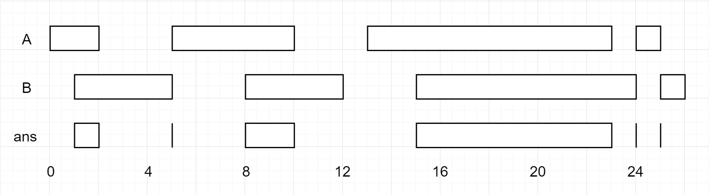

# 986. Interval List Intersections

https://leetcode.com/problems/interval-list-intersections/

# Difficulty
Medium

# Description
You are given two lists of closed intervals, `firstList` and `secondList`, where <code>firstList[i] = [start<sub>i</sub>, end<sub>i</sub>]</code> and secondList[j] = [start<sub>j</sub>, end<sub>j</sub>]. Each list of intervals is pairwise **disjoint** and in **sorted order**.

Return the intersection of these two interval lists.

A **closed interval** `[a, b]` (with `a <= b`) denotes the set of real numbers `x` with `a <= x <= b`.****

The **intersection** of two closed intervals is a set of real numbers that are either empty or represented as a closed interval. For example, the intersection of `[1, 3]` and `[2, 4]` is `[2, 3]`.

 

Example 1:

```
Input: firstList = [[0,2],[5,10],[13,23],[24,25]], secondList = [[1,5],[8,12],[15,24],[25,26]]
Output: [[1,2],[5,5],[8,10],[15,23],[24,24],[25,25]]
```

Example 2:
```
Input: firstList = [[1,3],[5,9]], secondList = []
Output: []
```

Constraints:
- <code>0 <= firstList.length, secondList.length <= 1000</code>
- <code>firstList.length + secondList.length >= 1</code>
- <code>0 <= start<sub>i</sub> < end<sub>i</sub> <= 10<sup>9</sup></code>
- <code>endi < start<sub>i</sub>+1</code>
- <code>0 <= start<sub>j</sub> < end<sub>j</sub> <= 10<sup>9</sup> </code>
- <code>end<sub>j</sub> < start<sub>j</sub>+1</code>

